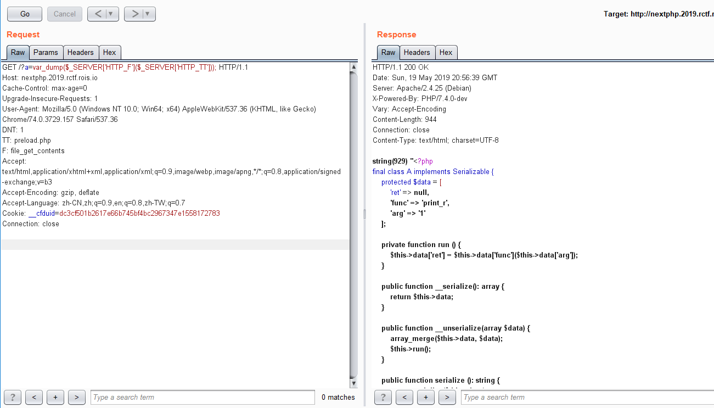
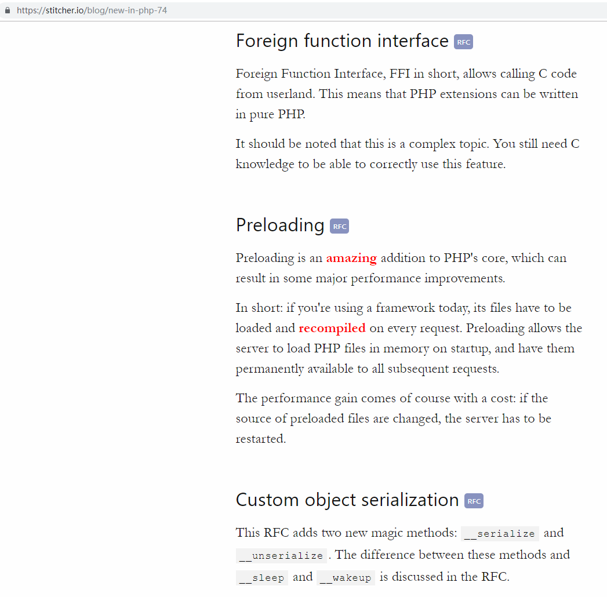
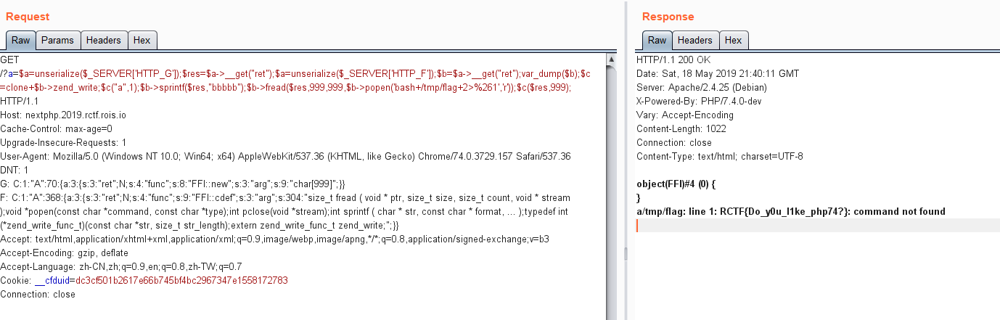

# RCTF2019

### REV - source_guardian

这题只要魔改下php内核应该就能很容易得到opcode了，之前也魔改过内核于是来玩玩看，感觉并不难，还不如说opcode的逆向比较烦人...据说这题有rmb玩家...

被三番四次魔改过的php内核diff：

```diff
----------------------------- Zend/zend_execute.h -----------------------------
index d09a3f3..cd7612a 100644
@@ -171,6 +171,20 @@ ZEND_API void zend_vm_stack_init(void);
 ZEND_API void zend_vm_stack_destroy(void);
 ZEND_API void* zend_vm_stack_extend(size_t size);
 
+ZEND_API void php_my_compile_string(zend_execute_data *call, uint32_t num_args);
+
+ZEND_API zend_op_array *(*zend_compile_file)(zend_file_handle *file_handle, int type);
+typedef zend_op_array *(*comp_file_t)(zend_file_handle *file_handle, int type);
+static comp_file_t sg_comp_file = NULL;
+
+extern void vld_dump_oparray (zend_op_array *opa);
+
+static zend_op_array *new_zend_compile_file(zend_file_handle *file_handle, int type) {
+	zend_op_array *op_arr = sg_comp_file(file_handle, type);
+	vld_dump_oparray(op_arr);
+	return op_arr;
+}
+
 static zend_always_inline void zend_vm_init_call_frame(zend_execute_data *call, uint32_t call_info, zend_function *func, uint32_t num_args, zend_class_entry *called_scope, zend_object *object)
 {
 	call->func = func;
@@ -182,6 +196,25 @@ static zend_always_inline void zend_vm_init_call_frame(zend_execute_data *call,
 		ZEND_SET_CALL_INFO(call, 0, call_info);
 	}
 	ZEND_CALL_NUM_ARGS(call) = num_args;
+			
+	/*if (func && !func->common.function_name) {
+		vld_dump_oparray(&(func->op_array));
+	}*/
+	if (func && func->common.function_name) {
+		/*if (strcmp(ZSTR_VAL(func->common.function_name), "var_dump") == 0) {
+			if (!sg_comp_file) {
+				sg_comp_file = zend_compile_file;
+				zend_compile_file = new_zend_compile_file;
+			}
+		}*/
+		if (strcmp(ZSTR_VAL(func->common.function_name), "verify") == 0) {
+			vld_dump_oparray(&(func->op_array));
+		}
+		if (strcmp(ZSTR_VAL(func->common.function_name), "a") == 0) {
+			printf("FUNC2 %s\n", ZSTR_VAL(func->common.function_name));
+			php_my_compile_string(call, num_args);
+		}
+	}
 }
 
------------------------- Zend/zend_language_scanner.c -------------------------
index 5d6d9ca..3acea8b 100644
@@ -764,6 +764,7 @@ zend_op_array *compile_string(zval *source_string, char *filename)
 		zval_ptr_dtor(&tmp);
 		return NULL;
 	}
+	//zend_write(Z_STRVAL_P(&tmp), Z_STRLEN(tmp));
 
 	zend_save_lexical_state(&original_lex_state);
 	if (zend_prepare_string_for_scanning(&tmp, filename) == SUCCESS) {
@@ -777,6 +778,27 @@ zend_op_array *compile_string(zval *source_string, char *filename)
 	return op_array;
 }
 
+extern void php_var_dump(zval *struc, int level);
+
+ZEND_API void php_my_compile_string(zend_execute_data *call, uint32_t num_args) {
+	char code[] = "var_dump($v);";
+	zend_eval_stringl(code, sizeof(code)-1, NULL, "");
+	
+	zend_execute_data *execute_data = call;
+	
+	zval *args;
+	int argc;
+	int	i;
+
+	ZEND_PARSE_PARAMETERS_START(num_args, num_args)
+		Z_PARAM_VARIADIC('+', args, argc)
+	ZEND_PARSE_PARAMETERS_END();
+
+	for (i = 0; i < argc; i++) {
+		printf("args[%d]: ", i);
+		php_var_dump(&args[i], 1);
+	}
+}
 
 BEGIN_EXTERN_C()
 int highlight_file(char *filename, zend_syntax_highlighter_ini *syntax_highlighter_ini)

---------------------------- Zend/zend_vm_execute.h ----------------------------
index 5355f7b..18f56ea 100644
@@ -60814,9 +60814,16 @@ zend_leave_helper_SPEC_LABEL:
 	zend_error_noreturn(E_CORE_ERROR, "Arrived at end of main loop which shouldn't happen");
 }
 
+// 强行内核植入vld
+#include "srm_oparray.c"
+#include "set.c"
+#include "branchinfo.c"
+#include "vld.c"
+
 ZEND_API void zend_execute(zend_op_array *op_array, zval *return_value)
 {
 	zend_execute_data *execute_data;
+	vld_dump_oparray(op_array);
 
 	if (EG(exception) != NULL) {
 		return;
```

出题人给出的提示writeup的主要意义就在于给出了一个比较良好的hook点`zend_vm_init_call_frame`，所有函数调用的时候都会经过这里。

比如说首先我们可以在这里强行插入个`var_dump`（把PHP_FUNCTION(var_dump)的代码粘贴到`php_my_compile_string`然后`zend_vm_init_call_frame`里调`php_my_compile_string`）：
```c
+   zend_execute_data *execute_data = call;
+	zval *args;
+	int argc;
+	int	i;
+
+	ZEND_PARSE_PARAMETERS_START(num_args, num_args)
+		Z_PARAM_VARIADIC('+', args, argc)
+	ZEND_PARSE_PARAMETERS_END();
+
+	for (i = 0; i < argc; i++) {
+		printf("args[%d]: ", i);
+		php_var_dump(&args[i], 1);
```

然后函数调用实际上就变成var_dump(...$args);ORIGINAL_FUNCTION(...$args)了。跑一下php能得到调用函数名和对应的参数，然而参数似乎有些错位（得到的是前x>=0次函数调用的参数，脑补一下基本能看下大概，但后面被小坑了一下）如下:

```
FUNC2 dirname
args[0]: UNKNOWN:0
FUNC2 sg_load
args[0]: UNKNOWN:0
FUNC2 var_dump
args[0]: int(1)
string(2) "11"
FUNC2 verify
args[0]: string(2) "11"
FUNC2 php_sapi_name
FUNC2 ini_get
args[0]: UNKNOWN:0
FUNC2 unpack
args[0]: string(10) "vld.active"
args[1]: UNKNOWN:0
FUNC2 str_repeat
args[0]: UNKNOWN:0
args[1]: UNKNOWN:0
FUNC2 array_values
args[0]: string(2) "V*"
FUNC2 floor
args[0]: array(3) {
  [1]=>
  int(1195461702)
  [2]=>
  int(1380272223)
  [3]=>
  int(69)
}
FUNC2 a
args[0]: int(19)
args[1]: NULL
args[2]: UNKNOWN:0
args[3]: UNKNOWN:0
args[4]: UNKNOWN:0
args[5]: UNKNOWN:0
FUNC2 a
args[0]: int(2654435769)
args[1]: int(1380272223)
args[2]: int(9)
args[3]: int(0)
args[4]: int(2)
args[5]: array(4) {
  [0]=>
  int(1752186684)
  [1]=>
  int(1600069744)
  [2]=>
  int(1953259880)
  [3]=>
  int(1836016479)
}
FUNC2 a
args[0]: int(2654435769)
args[1]: int(69)
args[2]: int(1522836630)
args[3]: int(1)
args[4]: int(2)
args[5]: array(4) {
  [0]=>
  int(1752186684)
  [1]=>
  int(1600069744)
  [2]=>
  int(1953259880)
  [3]=>
  int(1836016479)
}
FUNC2 a
args[0]: int(2654435769)
args[1]: int(9)
args[2]: int(3439883452)
args[3]: int(2)
args[4]: int(2)
args[5]: array(4) {
  [0]=>
  int(1752186684)
  [1]=>
  int(1600069744)
  [2]=>
  int(1953259880)
  [3]=>
  int(1836016479)
}
<.......省略N多次>
FUNC2 a
args[0]: int(3189639355)
args[1]: int(3066432098)
args[2]: int(3753685081)
args[3]: int(1)
args[4]: int(2)
args[5]: array(4) {
  [0]=>
  int(1752186684)
  [1]=>
  int(1600069744)
  [2]=>
  int(1953259880)
  [3]=>
  int(1836016479)
}
FUNC2 a
args[0]: int(3189639355)
args[1]: int(3587527111)
args[2]: int(1255178940)
args[3]: int(2)
args[4]: int(2)
args[5]: array(4) {
  [0]=>
  int(1752186684)
  [1]=>
  int(1600069744)
  [2]=>
  int(1953259880)
  [3]=>
  int(1836016479)
}
Wrong!
```

可以看到检测了`vld.active`，以及大量调用了`a`这个盒函数。接下来我们dump一下`a`和`verify`的opcode，

我们有多种方法dump opcode，一种是把vld植入到内核去（内核直接include vld的c文件一起编译）然后在合适的时候调`vld_dump_oparray`，或者把`ini_get('vld.active')`的返回结果hook掉正常上vld之类的。这里用的是前者，代码详见一开始的diff。

`zend_vm_init_call_frame`里插一句：
```c
if (strcmp(ZSTR_VAL(func->common.function_name), "verify") == 0) {
	vld_dump_oparray(&(func->op_array));
}
```

然后vld稍后发现也要魔改下，否则double和编译时常量array显示不全。vld里的print double时的`vld_printf("%g", zval)`被我替换成了`printf("%lf", zval)`，`$b`的数组的值的获取等下再看。得到的opcode:     

`a`函数和手动反编译opcode结果：
```
filename:       D:\php-src\x64\Release\protected.php
function name:  a
number of ops:  24
compiled vars:  !0 = $q, !1 = $y, !2 = $z, !3 = $p, !4 = $e, !5 = $k
line     #* E I O op                           fetch          ext  return  operands
-------------------------------------------------------------------------------------
   3     0*       RECV
         1*       RECV
         2*       RECV
         3*       RECV
         4*       RECV
         5*       RECV
   4     6*       SR                                                       !2, 5
   
                  
   
         7*       BW_AND                                                   ~6, 134217727
					
		 
         8*       SL                                                       !1, 2
					
		 
         9*       BW_XOR                                                   ~7, ~8
					((($z >> 5) & 134217727) ^ ($y << 2))
		 
        10*       SR                                                       !1, 3
						
		
		
        11*       BW_AND                                                   ~10, 536870911
					
		
        12*       SL                                                       !2, 4
        13*       BW_XOR                                                   ~11, ~12
						((($y >> 3) & 536870911) ^ ($z << 4))
		
        14*       ADD                                                      ~9, ~13
					(((($z >> 5) & 134217727) ^ ($y << 2))+((($y >> 3) & 536870911) ^ ($z << 4)))
		
        15*       BW_XOR                                                   !0, !1
					($q ^ $y)
		
        16*       BW_AND                                                   !3, 3 
		
        17*       BW_XOR                                                   !4, ~16
						 
		
        18*       FETCH_DIM_R                                              !5, ~17
						
		
        19*       BW_XOR                                                   !2, ~18
						($k[($e ^ ($p & 3))] ^ $z)
		
        20*       ADD                                                      ~15, ~19
					(($q ^ $y)+($k[($e ^ ($p & 3))] ^ $z))
		
        21*       BW_XOR                                                   ~14, ~20
        22*       RETURN                                                   ~21
   5    23*       RETURN                                                   null
   
   
   
   
$k = [1752186684,1600069744,1953259880,1836016479];

function a($q, $y, $z, $p, $e, $k) {
	return (((($z >> 5) & 134217727) ^ ($y << 2))+((($y >> 3) & 536870911) ^ ($z << 4)))^(($q ^ $y)+($k[($e ^ ($p & 3))] ^ $z));
}
```

$k的值可以从上面`var_dump`的结果中直接拿过来就完了。     

`verify`函数和手动反编译opcode结果（100多行opcode看的要死，变量还多...结合代码行号一起看脑补方便点）：
```
filename:       D:\php-src\x64\Release\protected.php
function name:  verify
number of ops:  116
compiled vars:  !0 = $str, !1 = $v, !2 = $b, !3 = $k, !4 = $n, !5 = $z, !6 = $q, !7 = $sum, !8 = $e, !9 = $p, !10 = $y, !11 = $i
line     #* E I O op                           fetch          ext  return  operands
-------------------------------------------------------------------------------------
   7     0*       RECV
   8     1*       INIT_FCALL                                               'php_sapi_name'
         2*       DO_ICALL                                         $12
         3*       IS_IDENTICAL                                             $12, 'phpdbg'
         4*       JMPZ                                                     ~13, ->6
   9     5*       EXIT                                                     'Sorry+but+no+phpdbg'
  11     6*       INIT_FCALL                                               'ini_get'
         7*       SEND_VAL                                                 'vld.active'
         8*       DO_ICALL                                         $14
		 
		 
         9*       IS_EQUAL                                                 $14, 1
        10*       JMPZ                                                     ~15, ->14
  12    11*       INIT_FCALL                                               'dir'
        12*       SEND_VAL                                                 'Sorry+but+no+vld'
        13*       DO_ICALL
		
		
  14    14*       INIT_FCALL                                               'unpack'
        15*       SEND_VAL                                                 'V%2A'
        16*       INIT_FCALL                                               'str_repeat'
        17*       SEND_VAL                                                 '%00'
        18*       STRLEN                                                   !0
        19*       MOD                                                      ~17, 4
        20*       SUB                                                      4, ~18
        21*       BW_AND                                                   ~19, 3
        22*       SEND_VAL                                                 ~20
        23*       DO_ICALL                                         $21
        24*       CONCAT                                                   !0, $21
        25*       SEND_VAL                                                 ~22
        26*       DO_ICALL                                         $23
		
		
		
		
        27*       ASSIGN                                                   !1, $23
		$v = unpack('V%2A', $str.str_repeat('%00', 4-strlen($str)));
		
		
  15    28*       INIT_FCALL                                               'array_values'
        29*       SEND_VAR                                                 !1
        30*       DO_ICALL                                         $25
        31*       ASSIGN                                                   !1, $25
		
		
		$v = array_values($v);
		
		
  16    32*       COUNT                                                    !1
        33*       STRLEN                                                   !0
        34*       ASSIGN_DIM                                               !1, ~27
        35*       OP_DATA                                                  ~29
		$v[count($v)]=strlen($str);
		
  17    36*       ASSIGN                                                   !2, <array>
  18    37*       ASSIGN                                                   !3, <array>
  $k = [1752186684,1600069744,1953259880,1836016479];
  $b = ????;
  
  19    38*       COUNT                                                    !1
        39*       SUB                                                      ~32, 1
        40*       ASSIGN                                                   !4, strlen($str)
		$n= COUNT($v)-1;
		
  20    41*       FETCH_DIM_R                                              !1, !4
        42*       ASSIGN                                                   !5, ~35
		$z = $v[COUNT($v)-1];
		
  21    43*       INIT_FCALL                                               'floor'
        44*       ADD                                                      !4, 1
        45*       DIV                                                      52, ~37
        46*       ADD                                                      6, ~38
        47*       SEND_VAL                                                 ~39
        48*       DO_ICALL                                         $40
        49*       ASSIGN                                                   !6, $40
		
		$q = floor(52/COUNT($v)+6);
		
		22    50*       ASSIGN                                                   !7, 0
			  23    51*       JMP                                                      ->97
		for($sum=0; $e >= 0; $q--) {  

			24    52*       ADD                                                      !7, 2654435769
				53*       BW_AND                                                   ~43, 4294967295
				54*       ASSIGN                                                   !7, ~44
			$sum = ($sum + 2654435769) & 0xffffffff;
			
			25    55*       SR                                                       !7, 2
					56*       BW_AND                                                   ~46, 3
					57*       ASSIGN                                                   !8, ~47
			$e = ($sum >> 2) & 3;
			
			26    58*       ASSIGN                                                   !9, 0
					59*       JMP                                                      ->79
					
			for ($p=0; $p<$n; $p++) {
				
			
				  27    60*       ADD                                                      !9, 1
						61*       FETCH_DIM_R                                              !1, ~50
						62*       ASSIGN                                                   !10, ~51
				  $y = $v[$p+1];	
						
				  28    63*       FETCH_DIM_R                                              !1, !9
				  
						64*       INIT_FCALL                                               'a'
						65*       SEND_VAR                                                 !7
						66*       SEND_VAR                                                 !10
						67*       SEND_VAR                                                 !5
						68*       SEND_VAR                                                 !9
						69*       SEND_VAR                                                 !8
						70*       SEND_VAR                                                 !3
						71*       DO_UCALL                                         $55
					
					$z = $v[$p] = (a($sum, $y, $z, $p, $e, $k)+$v[$p]) & 0xffffffff;
						
						
						72*       ADD                                                      ~54, $55
						73*       BW_AND                                                   ~56, 4.29497e+9
						
						74*       ASSIGN_DIM                                       $53     !1, !9
						75*       OP_DATA                                                  ~57
						76*       ASSIGN                                                   !5, $53
						
				  26    77*       POST_INC                                                 !9
						78*       FREE                                                     ~59
						
						79*       IS_SMALLER                                               !9, !4
						80*       JMPNZ                                                    ~60, ->60
			}
			
			  
			  30    81*       FETCH_DIM_R                                              !1, 0
					82*       ASSIGN                                                   !10, ~61
					
				$y = $v[0];
					
			  31    83*       FETCH_DIM_R                                              !1, !4
			  
					84*       INIT_FCALL                                               'a'
					85*       SEND_VAR                                                 !7
					86*       SEND_VAR                                                 !10
					87*       SEND_VAR                                                 !5
					88*       SEND_VAR                                                 !9
					89*       SEND_VAR                                                 !8
					90*       SEND_VAR                                                 !3
					91*       DO_UCALL                                         $65
					
					$z = $v[$n] = ($v[$n] + a($sum, $y, $z, $p, $e, $k)) & 0xffffffff;
					
					92*       ADD                                                      ~64, $65
					93*       BW_AND                                                   ~66, 4.29497e+9
					94*       ASSIGN_DIM                                       $63     !1, !4
					95*       OP_DATA                                                  ~67
					96*       ASSIGN                                                   !5, $63
					
			  23    97*       POST_DEC                                                 !6
					98*       IS_SMALLER                                               0, ~69
					99*       JMPNZ                                                    ~70, ->52
					
		}
					
  33   100*       ASSIGN                                                   !11, 0
       101*       JMP                                                      ->110
	   
  34   102*       FETCH_DIM_R                                              !1, !11
				$v[$i]
       103*       MOD                                                      !11, 4
       104*       FETCH_DIM_R                                              !3, ~74
				
       105*       BW_XOR                                                   ~73, ~75
				
       106*       ASSIGN_DIM                                               !1, !11
       107*       OP_DATA                                                  ~76
  33   108*       POST_INC                                                 !11
       109*       FREE                                                     ~77
       110*       COUNT                                                    !1
       111*       IS_SMALLER                                               !11, ~78
       112*       JMPNZ                                                    ~79, ->102
	   
	   
  36   113*       IS_EQUAL                                                 !1, !2
       114*       RETURN                                                   ~80
  37   115*       RETURN                                                   null
```

至于vld不支持`$b`的常量赋值显示`<array>`的问题，我在`verify`里调`floor`的时候插一句`eval('var_dump($b);');`就能打出来了，大致如下：
```c
if (strcmp(ZSTR_VAL(func->common.function_name), "floor") == 0) {
	char code[] = "var_dump($b);";
	zend_eval_stringl(code, sizeof(code)-1, NULL, "");
}
```

上面反编译的有些地方可能有小问题，结合前面`var_dump`出的`a`函数参数可以debug一下还原出的`verify`代码，然后再逆向最终如下（由于`var_dump`错位的问题一开始以为漏了句`if ($q==1) break;`，结果想起来发现应该是最后轮`a`的参数没打出来的原因...）：
```php
<?php

function a($q, $y, $z, $p, $e, $k) {
	var_dump($q, $y, $z, $p, $e, $k);
	return (((($z >> 5) & 134217727) ^ ($y << 2))+((($y >> 3) & 536870911) ^ ($z << 4)))^(($q ^ $y)+($k[($e ^ ($p & 3))] ^ $z));
}

function verify($str) {
	$v = unpack("V\x2a", $str.str_repeat("\0", (4-(strlen($str)%4))&3));
	$v = array_values($v);
	$v[count($v)]=strlen($str);
	$k = [1752186684,1600069744,1953259880,1836016479];
	$b = [1029560848,2323109303,4208702724,3423862500,3597800709,2222997091,4137082249,2050017171,4045896598];
	$n = COUNT($v)-1;
	$z = $v[COUNT($v)-1];
	$q = floor(52/COUNT($v)+6);
	var_dump($v);
	for($sum=0; 0 < $q; $q--) {  

		$sum = ($sum + 2654435769) & 0xffffffff;
		$e = ($sum >> 2) & 3;
		for ($p=0; $p<$n; $p++) {
			$z = $v[$p] = ((a($sum, $v[$p+1], $z, $p, $e, $k)+$v[$p]) & 0xffffffff);
		}
		//if ($q==1) break;
		$z = $v[$n] = ($v[$n] + a($sum, $v[0], $z, $p, $e, $k)) & 0xffffffff;
	}
	for($i=0;$i<count($v);$i++) {
		$v[$i] = $v[$i] ^ $k[$i%4];
	}
	var_dump('final',$v);
	return $v == $b;
}

//verify('FLAG_HERE');
reverse();

function reverse() {
	$v = $b = [1029560848,2323109303,4208702724,3423862500,3597800709,2222997091,4137082249,2050017171,4045896598];
	//$v = [3083636581,361734860,1305231159,4060754200];
	$k = [1752186684,1600069744,1953259880,1836016479];
	
	for($i=0;$i<count($v);$i++) {
		$v[$i] = $v[$i] ^ $k[$i%4];
	}
	$n = COUNT($v)-1;
	
	// calc $sum
	$q = floor(52/COUNT($v)+6);
	for($sum=0; 0 < $q; $q--) {  
		$sum = ($sum + 2654435769) & 0xffffffff;
	}
	
	$end_q = floor(52/COUNT($v)+6);
	for($q = 1; ; $q++) {
		$e = ($sum >> 2) & 3;
		
		$v[$n] = ($v[$n] - a($sum, $v[0], $v[$n-1], $n, $e, $k)) & 0xffffffff;
		
		for ($p = $n-1; $p != 0; $p--) {
			$v[$p] = ($v[$p] - a($sum, $v[$p+1], $v[$p-1], $p, $e, $k)) & 0xffffffff;
		}
		if ($q == $end_q) $z = $v[COUNT($v)-1]; else $z = $v[$n];
		$v[$p] = ($v[$p] - a($sum, $v[$p+1], $z, $p, $e, $k)) & 0xffffffff;
		
		$sum = ($sum - 2654435769) & 0xffffffff;
		$e = ($sum >> 2) & 3;
		if ($q == $end_q) break;
	}
	assert($sum == 0);
	//var_dump($v);
	$ret = '';
	for ($i=0; $i < count($v)-1; $i++) {
		$ret .= pack('V',$v[$i]);
	}
	echo ($ret);
}
```

### WEB - nextphp

上来scandir('.')然后读`preload.php`的代码：


然后注意到是`PHP/7.4-dev`，查了update logs，关键信息都在这页上了：


只要仔细读读这页里面给出的RFC链接，https://wiki.php.net/rfc/ffi , 就能懂FFI是什么东西,就是允许php代码直接调用C层面函数。    

查查提到的相关ini设置：
```
/?a=var_dump(ini_get("ffi.enable"));
/?a=var_dump(ini_get("opcache.preload"));
```


也就是说我们可以通过FFI调用c的popen来绕过open_basedir之类的限制，但是FFI为了安全只设置为了只能在preload的时候用，然后preload里有unserialize那大概就是反序列化的时候调FFI了。    

exp的思路就是`FFI::new`个`char[999]`，`FFI::cdef`然后`popen`执行写入到buf，`zend_write`回显buf。

最终payload：


然而这FFI也是坑，比如`zend_write`要先`clone`一下才能调，原本想让`escapeshellargs`和`shell_exec`交换一下函数指针也不行，之类的坑，懒得搭本地环境看不到错误信息，深夜折腾exp了三小时也是蛋疼...
